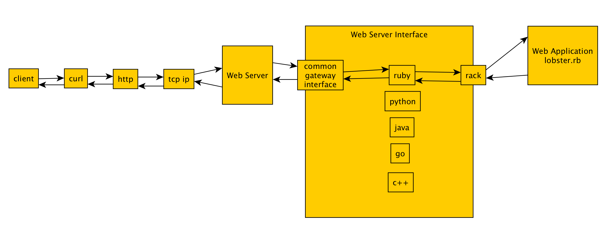

# Rack Playground
>Learn about rack by hacking on it.

## Overview

* Up and running
* Get the lobster working
* Hack on the lobster for a smaller stack trace

## Up and running

http://rack.github.io/

```
ruby <<EOF
require 'rack'

app = Proc.new do |env|
    ['200', {'Content-Type' => 'text/html'}, ['A barebones rack app.']]
end

Rack::Handler::WEBrick.run app
EOF
[2018-03-13 22:47:22] INFO  WEBrick 1.3.1
[2018-03-13 22:47:22] INFO  ruby 2.4.2 (2017-09-14) [x86_64-darwin16]
[2018-03-13 22:47:22] INFO  WEBrick::HTTPServer#start: pid=47072 port=8080
::1 - - [13/Mar/2018:22:47:27 PDT] "GET / HTTP/1.1" 200 21
- -> /
```

```
curl localhost:8080
A barebones rack app.
```

## Get the lobster working

```
gem which rack
/Users/max/.gem/ruby/2.4.2/gems/rack-2.0.4/lib/rack.rb
find /Users/max/.gem/ruby/2.4.2/gems/rack-2.0.4/lib/ -name *lobster.rb
/Users/max/.gem/ruby/2.4.2/gems/rack-2.0.4/lib//rack/lobster.rb
cp $(!!) .
ls
README.md	lobster.rb
ruby lobster.rb
Thin web server (v1.7.2 codename Bachmanity)
Maximum connections set to 1024
Listening on localhost:9292, CTRL+C to stop
RuntimeError: Lobster crashed
	lobster.rb:45:in `call'
	/Users/max/.gem/ruby/2.4.2/gems/rack-2.0.4/lib/rack/lint.rb:49:in `_call'
	/Users/max/.gem/ruby/2.4.2/gems/rack-2.0.4/lib/rack/lint.rb:37:in `call'
	/Users/max/.gem/ruby/2.4.2/gems/rack-2.0.4/lib/rack/show_exceptions.rb:23:in `call'
	/Users/max/.gem/ruby/2.4.2/gems/thin-1.7.2/lib/thin/connection.rb:86:in `block in pre_process'
	/Users/max/.gem/ruby/2.4.2/gems/thin-1.7.2/lib/thin/connection.rb:84:in `catch'
	/Users/max/.gem/ruby/2.4.2/gems/thin-1.7.2/lib/thin/connection.rb:84:in `pre_process'
	/Users/max/.gem/ruby/2.4.2/gems/thin-1.7.2/lib/thin/connection.rb:53:in `process'
	/Users/max/.gem/ruby/2.4.2/gems/thin-1.7.2/lib/thin/connection.rb:39:in `receive_data'
	/Users/max/.gem/ruby/2.4.2/gems/eventmachine-1.2.5/lib/eventmachine.rb:194:in `run_machine'
	/Users/max/.gem/ruby/2.4.2/gems/eventmachine-1.2.5/lib/eventmachine.rb:194:in `run'
	/Users/max/.gem/ruby/2.4.2/gems/thin-1.7.2/lib/thin/backends/base.rb:73:in `start'
	/Users/max/.gem/ruby/2.4.2/gems/thin-1.7.2/lib/thin/server.rb:162:in `start'
	/Users/max/.gem/ruby/2.4.2/gems/rack-2.0.4/lib/rack/handler/thin.rb:22:in `run'
	/Users/max/.gem/ruby/2.4.2/gems/rack-2.0.4/lib/rack/server.rb:297:in `start'
	/Users/max/.gem/ruby/2.4.2/gems/rack-2.0.4/lib/rack/server.rb:148:in `start'
	lobster.rb:67:in `<main>'
^CStopping ...
```

Such a deep stack trace. But why? Looks like rack is using the thin webserver.

Read about the thin web server.

https://github.com/macournoyer/thin
>A very fast & simple Ruby web server


Fast and simple usually don't go together. I want to learn about rack not web server speed improvements.

But this is why rack is so awesome. I can use a different web server!

## Hack on the lobster for a smaller stack trace

```
ruby lobster.rb
[2018-03-13 23:00:07] INFO  WEBrick 1.3.1
[2018-03-13 23:00:07] INFO  ruby 2.4.2 (2017-09-14) [x86_64-darwin16]
[2018-03-13 23:00:07] INFO  WEBrick::HTTPServer#start: pid=47683 port=9292
[2018-03-13 23:00:10] ERROR RuntimeError: Lobster crashed
	lobster.rb:41:in `call'
	/Users/max/.gem/ruby/2.4.2/gems/rack-2.0.4/lib/rack/handler/webrick.rb:86:in `service'
	/Users/max/.rubies/ruby-2.4.2/lib/ruby/2.4.0/webrick/httpserver.rb:140:in `service'
	/Users/max/.rubies/ruby-2.4.2/lib/ruby/2.4.0/webrick/httpserver.rb:96:in `run'
	/Users/max/.rubies/ruby-2.4.2/lib/ruby/2.4.0/webrick/server.rb:290:in `block in start_thread'
::1 - - [13/Mar/2018:23:00:10 PDT] "GET /?flip=crash HTTP/1.1" 500 295
- -> /?flip=crash
```

```
curl -I localhost:9292/?flip=crash
HTTP/1.1 500 Internal Server Error
Content-Type: text/html; charset=ISO-8859-1
Server: WEBrick/1.3.1 (Ruby/2.4.2/2017-09-14)
Date: Wed, 14 Mar 2018 06:03:21 GMT
Content-Length: 295
Connection: close
```

This makes so much more sense.

* A get request comes in from an HTTP client, `curl`, the request has query params `flip=crash`.
* The request hits an HTTP web server which is built using Ruby, it's name is webrick and it's in the standard library.
* The HTTP web server hands the request off to a handler that's a class defined in a gem named rack.
* As expected, rack calls the rack application, an instance of the class Lobster with an instance method `#call`
* Inside `call` something goes wrong on line 41

```
awk 'NR==41' lobster.rb
      raise "Lobster crashed"
```


